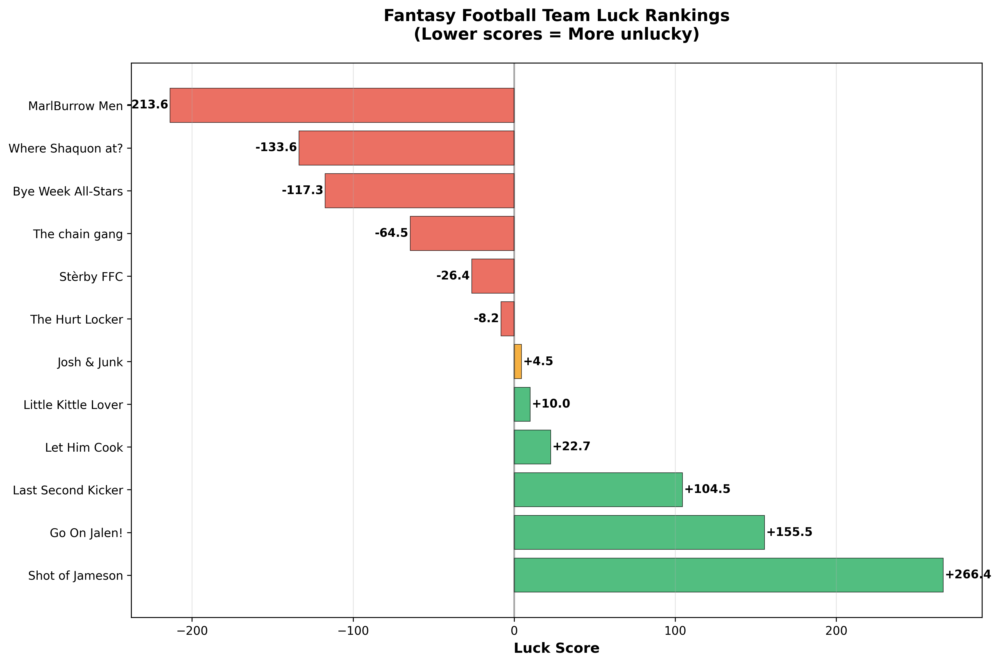
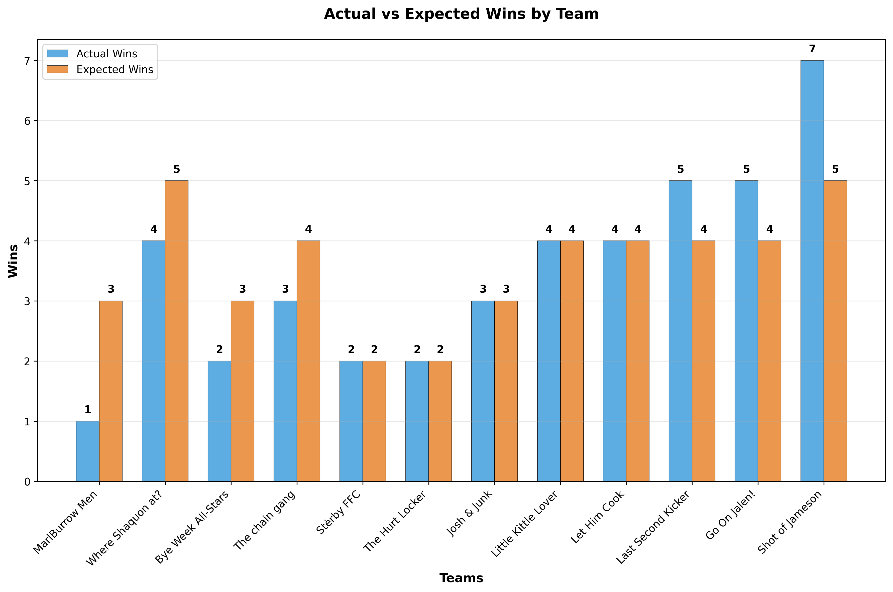
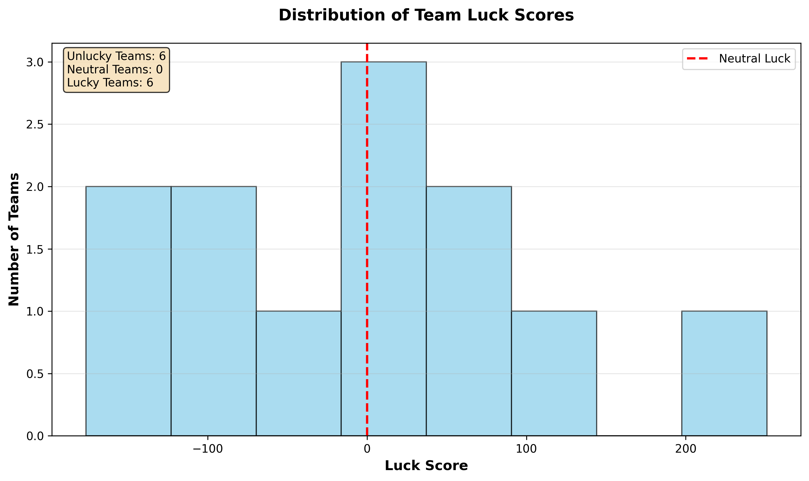

# 🏈 Gang of Gridiron Gurus - Fantasy Football Analysis Report

> **Analysis Date:** October 22, 2025 | **Weeks Analyzed:** 7 completed weeks

---

## � Table of Contents
- [Executive Summary](#-executive-summary)
- [Luck Rankings](#-luck-rankings) 
- [Weekly Scoring Trends](#-weekly-scoring-trends)
- [Performance Analysis](#-performance-analysis)
- [Methodology](#-methodology)

---

## 📊 Executive Summary

This comprehensive analysis examines team performance across **7 weeks** of fantasy football action. We analyze both **luck factors** (schedule strength and opponent matchups) and **scoring trends** (momentum and consistency) to provide actionable insights for your league.

### Key Findings:
- **Most Lucky Team:** Teams with positive luck scores are winning more than their scoring suggests
- **Most Unlucky Team:** Teams with negative luck scores are underperforming their scoring ability
- **Hottest Team:** Teams with strong upward scoring trends are building momentum
- **Most Consistent:** Teams with low volatility provide reliable weekly production

---

## 🏆 Luck Rankings

*Teams ranked by luck score - negative scores indicate unlucky teams who should have better records*

| Rank | Team | Luck Score | Record | Should Be | Diff |
|------|------|------------|--------|-----------|------|
| 1 | MarlBurrow Men 💀 | -213.6 | 1-6 | 3-4 | -2 |
| 2 | Where Shaquon at? 💀 | -133.6 | 4-3 | 5-2 | -1 |
| 3 | Bye Week All-Stars 💀 | -117.3 | 2-5 | 3-4 | -1 |
| 4 | The chain gang 💀 | -64.5 | 3-4 | 4-3 | -1 |
| 5 | Stèrby FFC 💀 | -26.4 | 2-5 | 2-5 | +0 |
| 6 | The Hurt Locker 💀 | -8.2 | 2-5 | 2-5 | +0 |
| 7 | Josh & Junk 😐 | +4.5 | 3-4 | 3-4 | +0 |
| 8 | Little Kittle Lover 🍀 | +10.0 | 4-3 | 4-3 | +0 |
| 9 | Let Him Cook 🍀 | +22.7 | 4-3 | 4-3 | +0 |
| 10 | Last Second Kicker 🍀 | +104.5 | 5-2 | 4-3 | +1 |
| 11 | Go On Jalen! 🍀 | +155.5 | 5-2 | 4-3 | +1 |
| 12 | Shot of Jameson 🍀 | +266.4 | 7-0 | 5-2 | +2 |

##  Performance Analysis

### ⚖️ Wins: Actual vs Expected

*Comparing real records against "should have" records based on scoring performance*

This analysis reveals which teams have been **schedule beneficiaries** versus **schedule victims**. The orange bars show what each team's record should be based purely on their scoring output, while blue bars show their actual record.

### 🎲 Luck Distribution

*Distribution of luck scores across the league - most teams cluster around neutral (0)*

This chart shows the distribution of luck scores across all teams. Positive values indicate lucky teams, while negative values show unlucky teams.

### 🎰 Most Extreme Weeks

*The biggest lucky breaks and unlucky losses of the season*

- **Luckiest:** Shot of Jameson Week 1 - 87.3 vs 76.0 (**WIN**)
- **Unluckiest:** Shot of Jameson Week 4 - 132.4 vs 91.4 (**WIN**)
- **Luckiest:** MarlBurrow Men Week 4 - 120.8 vs 87.1 (**WIN**)
- **Unluckiest:** MarlBurrow Men Week 7 - 132.2 vs 133.7 (**LOSS**)
- **Luckiest:** Go On Jalen! Week 5 - 99.3 vs 85.4 (**WIN**)

---

## 📈 Weekly Scoring Trends

*Track team momentum, consistency, and recent form to predict future performance*

This **heatmap visualization** displays each team's weekly scoring performance with color-coded intensity. Darker blue cells indicate higher scores, while lighter/white cells show lower performances. The **sparklines** on the right reveal each team's trajectory: ↗ rising trends (green), → stable performance (gray), and ↘ declining trends (red). Teams are sorted by average scoring to easily identify the strongest performers.

### 🔥 Momentum Analysis

*Teams sorted by recent form (last 3 weeks average)*

| Team | Avg Score | Recent Form | Trend | Volatility |
|------|-----------|-------------|-------|------------|
| Shot of Jameson | 118.0 | 126.5 | ⬆️ +5.2/wk | 13% |
| Last Second Kicker | 111.4 | 125.3 | ⬆️ +4.2/wk | 15% |
| Where Shaquon at? | 118.0 | 120.5 | ➡️ -0.9/wk | 14% |
| Bye Week All-Stars | 101.8 | 119.2 | ⬆️ +9.1/wk | 23% |
| MarlBurrow Men | 103.5 | 113.1 | ⬆️ +6.3/wk | 20% |
| Little Kittle Lover | 111.3 | 112.3 | ⬆️ +3.5/wk | 15% |
| Josh & Junk | 101.4 | 106.4 | ➡️ -0.5/wk | 14% |
| The chain gang | 111.9 | 103.3 | ➡️ +0.1/wk | 17% |
| Let Him Cook | 108.8 | 99.6 | ⬇️ -2.3/wk | 10% |
| Stèrby FFC | 99.0 | 98.5 | ➡️ -0.5/wk | 10% |
| Go On Jalen! | 109.0 | 92.3 | ⬇️ -4.2/wk | 20% |
| The Hurt Locker | 92.4 | 91.0 | ⬇️ -1.5/wk | 24% |

---

## � Methodology

### Luck Score Calculation
- **Weekly Analysis**: For each week, calculate how many teams you would have beaten with your score
- **Opponent Strength**: Compare your actual opponent's strength to average opponent difficulty
- **Luck Factors**: 
  - ✅ **Positive Luck**: Beating stronger opponents or losing to weaker ones
  - ❌ **Negative Luck**: Losing to stronger opponents or beating weaker ones

### Scoring Trends Analysis
- **Momentum**: Linear regression slope showing points gained/lost per week
- **Recent Form**: Average scoring over last 3 weeks
- **Volatility**: Standard deviation of scoring (consistency measure)
- **Streaks**: Consecutive weeks above/below personal average

### Expected Wins Model
- **Fair Scheduling**: Calculate record based on scoring vs. all possible opponents each week
- **Schedule Strength**: Account for actual opponents faced vs. league average
- **Performance Prediction**: Use trends to project future performance

---

**📈 Generated by GGG Luck Fantasy Football Analyzer**

*Analysis Date: October 22, 2025*

*Unlock the patterns behind your fantasy success*

