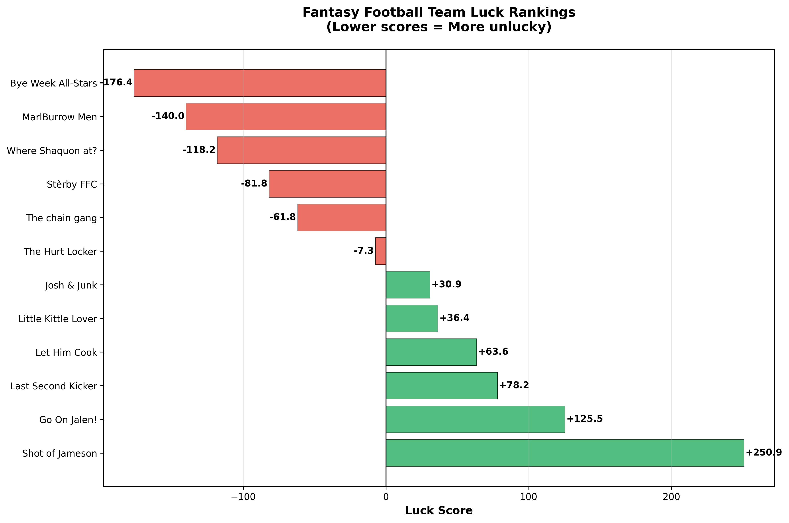
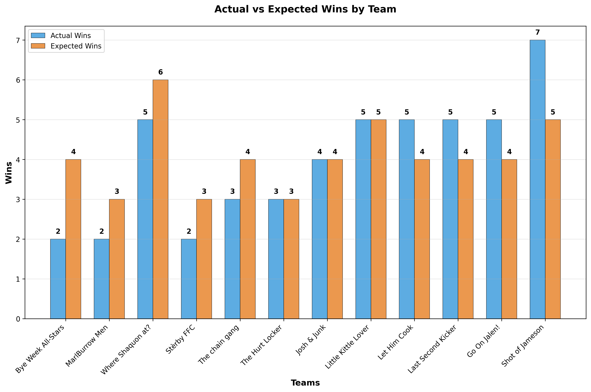

# 🏈 Fantasy Football Luck Analysis Report

**League:** Gang of Gridiron Gurus  
**Analysis Date:** October 23, 2025  
**Weeks Analyzed:** 7 completed weeks

---

## 📊 Executive Summary

This report analyzes team "luck" by comparing actual wins vs. expected wins based on weekly scoring performance. Teams that consistently win against weaker opponents while losing to stronger ones are considered "unlucky," while teams that beat stronger opponents or lose to weaker ones are "lucky."

## 🏆 Luck Rankings

| Rank | Team | Luck Score | Record | Should Be | Diff |
|------|------|------------|--------|-----------|------|
| 1 | MarlBurrow Men 💀 | -213.6 | 1-6 | 3-4 | -2 |
| 2 | Where Shaquon at? 💀 | -133.6 | 4-3 | 5-2 | -1 |
| 3 | Bye Week All-Stars 💀 | -117.3 | 2-5 | 3-4 | -1 |
| 4 | The chain gang 💀 | -64.5 | 3-4 | 4-3 | -1 |
| 5 | Stèrby FFC 💀 | -26.4 | 2-5 | 2-5 | +0 |
| 6 | The Hurt Locker 💀 | -8.2 | 2-5 | 2-5 | +0 |
| 7 | Josh & Junk 😐 | +4.5 | 3-4 | 3-4 | +0 |
| 8 | Little Kittle Lover 🍀 | +10.0 | 4-3 | 4-3 | +0 |
| 9 | Let Him Cook 🍀 | +22.7 | 4-3 | 4-3 | +0 |
| 10 | Last Second Kicker 🍀 | +104.5 | 5-2 | 4-3 | +1 |
| 11 | Go On Jalen! 🍀 | +155.5 | 5-2 | 4-3 | +1 |
| 12 | Shot of Jameson 🍀 | +266.4 | 7-0 | 5-2 | +2 |

## 📈 Luck Distribution

The chart above shows the distribution of luck scores across all teams. Positive values indicate lucky teams, while negative values show unlucky teams.

## ⚖️ Wins: Actual vs Expected

This chart compares each team's actual wins against what they "should have" won based on their scoring performance.

## 🎰 Most Extreme Weeks

- **Luckiest:** Shot of Jameson Week 1 - 87.3 vs 76.0 (**WIN**)
- **Unluckiest:** Shot of Jameson Week 4 - 132.4 vs 91.4 (**WIN**)
- **Luckiest:** MarlBurrow Men Week 4 - 120.8 vs 87.1 (**WIN**)
- **Unluckiest:** MarlBurrow Men Week 7 - 132.2 vs 133.7 (**LOSS**)
- **Luckiest:** Go On Jalen! Week 5 - 99.3 vs 85.4 (**WIN**)

## 📊 Methodology

**Luck Score Calculation:**
- Each week, we calculate how many teams you would have beaten with your score
- Compare your actual opponent's strength to the average opponent
- Positive luck = beating stronger opponents or losing to weaker ones
- Negative luck = losing to stronger opponents or beating weaker ones

**Expected Wins:**
- Based on your weekly scoring performance vs. all possible opponents
- Shows what your record "should be" in a perfectly fair scheduling system

---

*Generated by GGG Luck Fantasy Football Analyzer*  
*Analysis Date: October 23, 2025*
